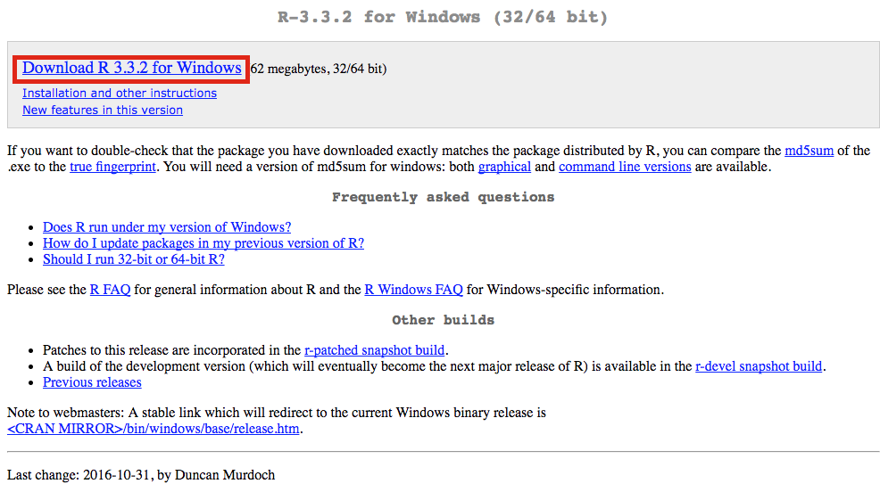

# Basic Data Analysis

**OBJECTIVES**

After reading this chapter, reader should be able to:

-   Understand the work flow and the concept of tidy data

-   Install and set up working environment for different languages and software, including R, Python and STATA in Rstudio IDE

-   Understand the principles and steps of data manipulation and implement in R, Python and STATA.

-   Perform basic descriptive statistics with R, Python and STATA such as mean, sd, frequency, statistical tests (Chi-squared, t-test, etc.)

-   Visualize data with ggplot2 package in R and matplotlib library in Python

-   Communicate your result with Rmarkdown or deploying a simple project with ShinyApp

## Introduction about work flow

The picture below described about a normal working process of data analysis.

First you must **import** your data. This typically means that you take data stored in a file, database, or web application programming interface (API), and load it into the software. In this course, we will work with *.xlsx* and *.csv* file, which are the most common type of storaging data.

<center>

{width="700"}

</center>

The next steps are **Tidying** and **Transforming** your data. Combining 2 steps, we have the so-called **Data Wrangling.** Tidying your data means storing it in a consistent form that matches the semantics of the dataset with the way it is stored. In brief, when your data is tidy, each column is a variable, and each row is an observation. Once you have tidy data, a common first step is to transform it. Transformation includes narrowing in on observations of interest, creating new variables that are functions of existing variables, and calculating a set of summary statistics (like counts or means).

**Visualization** is a fundamentally human activity. A good visualization will show you things that you did not expect, or raise new questions about the data. A good visualization might also hint that you're asking the wrong question, or you need to collect different data. Visualizations can surprise you, but don't scale particularly well because they require a human to interpret them.

**Models** are complementary tools to visualization. Once you have made your questions sufficiently precise, you can use a model to answer them. Models are a fundamentally mathematical or computational tool, so they generally scale well. But every model makes assumptions, and by its very nature a model cannot question its own assumptions. That means a model cannot fundamentally surprise you.

The last step of data science is **Communication**, an absolutely critical part of any data analysis project. It doesn't matter how well your models and visualization have led you to understand the data unless you can also communicate your results to others.

## Software installation

In this course, I will introduce you about the three most powerful statistical softwares including R, Python and STATA, their usage and their advantages as well as disadvantages. While R and Python is more a programming language, which can be a hurdle for some people, STATA is more user-friendly and balance between using Graphical User Interface (GUI) and saving script (*do file*). In short, you'll need to install the following programs in order:

-   **R**: A statistical programming language used to wrangle, analyze, and visualize data ([mac](https://cran.r-project.org/bin/macosx/), [windows](https://cran.r-project.org/bin/windows/base/))

-   **RStudio**: An interface for writing and running R code, which is a primary language for the quarter ([link)](https://www.rstudio.com/products/rstudio/download/). You can download a developing version [here](https://dailies.rstudio.com/), which will provide most up-to-date new features

-   **Python**: Another programming language, be preferred in machine learning, deep learning, AI. In this tutorial, we will install Python indirectly through package *reticulate* in R. More details will be presented later

-   **Git**: (Optional) A set of command-line tools for tracking changes to a project. This is likely already installed on Macs. The Windows download will come with Git Bash, a simple interface for executing Git commands ([link](https://git-scm.com/downloads))

-   **STATA**: This is paid software. You have to buy it before use or you can download a trial version [here](https://www.stata.com/customer-service/evaluate-stata/)

The following sections have additional information about the purpose of each component, how to install it, and alternative configurations.

### R

R is a popular data science language used to download, analyze, and visualize data. You can download it at the appropriate link for your operating system ([mac](https://cran.r-project.org/bin/macosx/), [windows](https://cran.r-project.org/bin/windows/base/)). At the link, click the appropriate download link and follow instructions:

<center>



</center>

To install package in R, type the following code to the console. For instance, you want to install `tidyverse` package

```{r, message = FALSE, warning=FALSE, eval=FALSE}
install.packages("tidyverse")
```

To call `tidyverse` package

```{r, message = FALSE, warning=FALSE, eval=FALSE}
library(tidyverse)
```

### Rstudio

The primary programming language we will use throughout the course is R. It's a very powerful statistical programming language that is built to work well with large and diverse datasets. While you are able to execute R scripts without an interface, the RStudio interface provides a wonderful way to engage with the R language. Importantly, you **cannot use the RStudio interface until you have installed R.**

To download the RStudio program, select the installer for your operating system at this [link](https://rstudio.com/products/rstudio/download/). Make sure to scroll down to download a **free** version of RStudio:

<center>


</center>

### Python

Python is a very popular all-purpose programming language that is making a major impact in the data-science arena. Some data scientists, and even some organizations, believe they have to pick between R or Python. However, this turns out to be a false choice. In fact, results from a surveys showed that many data science teams today are bilingual, leveraging both R and Python in their work. And while both languages have unique strengths, these teams frequently struggle to use them together.

Rstudio provides a prefect environment for data scientist through a package `reticulate`. Rstudio can be a potentially platform for data scientist who are using solely R or Python, or using both.

### Setting environment for R and Python

Firstly, you have to install reticulate package:

```{r, message = FALSE, warning=FALSE, eval=FALSE}
install.packages("reticulate")
```

Secondly, install the miniconda environment. I suggest you should install miniconda in your local disk, not your OS disk (i.e Disk C)

```{r, message = FALSE, warning=FALSE, eval=FALSE}
reticulate::install_miniconda("D:/Python")
reticulate::use_condaenv("D:/Python/envs/r-reticulate")
```

Thirdly, try to install Python package. There are two ways to do it, Reticulate style and Python style

**Reticulate** style

```{r, message = FALSE, warning=FALSE, eval=FALSE}
library(reticulate)
py_install("pandas") 
py_install("matplotlib")
```

**Python** style

Set Python PATH through Terminal. You copy this code and paste into Terminal console in your Rstudio: `setx PATH "%PATH%;D:\Python\envs\r-reticulate\Scripts"`\
Then try to run this code to install pandas package: `python -m pip install pandas`

### STATA

This is paid software. You have to buy it before use or you can download a trial version [here](https://www.stata.com/customer-service/evaluate-stata/)

If you want to use STATA in Rstudio, you can do it through `statamarkdown` package. Detail will be dicussed further in this document.

```{r setup STATA environment, message = FALSE, warning=FALSE, eval=FALSE}
install.packages("Statamarkdown")
library(Statamarkdown)
stataexe <- "C:/Program Files/Stata16/StataSE-64.exe"
knitr::opts_chunk$set(engine.path=list(stata=stataexe))
```

## Create working environment

Git is a version control system that provides a set of commands that allow you to manage changes to a project (much more on this in [module-3](https://github.com/info-201/m3-version-control)). For now, you'll need to [download](https://git-scm.com/downloads) and install the software. Note, if you are using a Windows machine, this will install a program called Git Bash, which provides a text-based interface for executing commands on your computer. To setup Git in your Rstudio, you can visit this [link](https://www.geo.uzh.ch/microsite/reproducible_research/post/rr-rstudio-git/).

For alternative/additional Windows command-line tools, see below:

**Git Bash**

Because we'll primarily use the command line for implementing version control (i.e., keeping track of changes to our code), we can use a command-line tool that ships with the version control software, Git. When you download the [Git](https://git-scm.com/downloads) software on Windows, the Git Bash user-interface will be installed. You can then navigate to Git Bash from your Desktop / Start Menu, and you will be able to use the appropriate syntax to keep track of code changes.

**Windows Bash**

With the release of Windows 10, Windows began providing command line (bash) support. If you already have Windows 10, here are a few [instructions](http://www.howtogeek.com/249966/how-to-install-and-use-the-linux-bash-shell-on-windows-10/) for installing bash capabilities. This requires that you [switch to 64 bit windows](http://www.howtogeek.com/228042/how-to-switch-from-32-bit-windows-10-to-64-bit-windows-10/), and follow the instructions above. While this will provide you with direct bash capabilities, you may run into challenges along the way (I have not tested these instructions). Note, you will still **need to install Git** in addition to Windows Bash.

**Powershell (Windows Management Framework)**

If you want to explore more robust command-line alternatives for Windows, the Windows Management Framework (including a program called Powershell) seems to be a preferred standard. Powershell will provide a simple text-based interface for inputing commands. Note, you will still **need to install Git** in addition to Powershell.

## Data manipulation

### Import file

There are several ways to import data, but the most preferred is from comma-separated values file (*.csv*). Other data types format you may normally see in your work are from text file (*.txt*), Excel spread sheets (*.xlsx*), STATA file (*.dta*), SPSS file (*.sav*), JavaScript Object Notation (*.json*), shapefile (*.shp*). In this tutorial, I will only concentrate on importing data from CSV file because of its ubiquitous in data analysis. We will use **calf** data set, you can download it [here](https://raw.githubusercontent.com/ntluong95/data/main/one-health/calf.csv).

**Dataset description**

These data come from a retrospective analysis of the medical records from all diarrheic calves which were presented to Atlantic Veterinary College, PEl, Canada between 1989 and 1993. There are 254 observations (records) and 14 variables in the dataset (calf):

+-----------+--------------------------------------+----------------------------+
| Variables | Description                          | Codes/Units                |
+===========+======================================+============================+
| case      | hospital case number                 |                            |
+-----------+--------------------------------------+----------------------------+
| age       | age at admission                     | days                       |
+-----------+--------------------------------------+----------------------------+
| breed     | breed                                | coded 1-9                  |
+-----------+--------------------------------------+----------------------------+
| sex       | sex                                  | 0 = female 1 = male        |
+-----------+--------------------------------------+----------------------------+
| attd      | attitude of calf                     | 0 = bright, alert          |
+-----------+--------------------------------------+----------------------------+
|           |                                      | 1 = depressed              |
+-----------+--------------------------------------+----------------------------+
|           |                                      | 2 = unresponsive, comatose |
+-----------+--------------------------------------+----------------------------+
| dehy      | \% dehydration                       |                            |
+-----------+--------------------------------------+----------------------------+
| eye       | uveitis/hypopyon clinically evident  | 0/1                        |
+-----------+--------------------------------------+----------------------------+
| jnts      | swollen joints clinically evident    | number of joints affected  |
+-----------+--------------------------------------+----------------------------+
| post      | posture of caIf                      | 0 = standing               |
+-----------+--------------------------------------+----------------------------+
|           |                                      | 1 = sternal                |
+-----------+--------------------------------------+----------------------------+
|           |                                      | 2 = lateral                |
+-----------+--------------------------------------+----------------------------+
| pulse     | pulse rate                           | beats per minute           |
+-----------+--------------------------------------+----------------------------+
| resp      | respiratory rate                     | breaths per minute         |
+-----------+--------------------------------------+----------------------------+
| temp      | rectal temperature                   | ^0^C                       |
+-----------+--------------------------------------+----------------------------+
| umb       | swollen umbilicus clinically evident | 0/1                        |
+-----------+--------------------------------------+----------------------------+
| sepsis    | sepsis **(outcome)**                 | 0/1                        |
+-----------+--------------------------------------+----------------------------+

**R**

To import data in R, you need `readr` package installed in your computer and use function `read_csv` to import file to the working environment.

```{r, message = FALSE, warning=FALSE}
library(readr) 
raw_df <- read_csv("D:/Book Writing/1. Applied Epidemiology in One Health/data/calf.csv")

glimpse(raw_df)
```

**Python**

First, you have to register to use Python in R via package `reticulate`

```{r }
reticulate::use_condaenv("D:/Python/envs/r-reticulate")
```

```{python }
import os as os
os.environ['QT_QPA_PLATFORM_PLUGIN_PATH'] = "D:/Python/envs/r-reticulate/Library/plugins/platforms"
```

Now, you can import CSV file by Python using library `pandas` with function `read_csv`

```{python, message = FALSE, warning=FALSE}
import pandas as pd
raw_df = pd.read_csv("D:/Book Writing/1. Applied Epidemiology in One Health/data/calf.csv")

raw_df.head()
```

**STATA**

First, setup STATA code chunk in Rmarkdown

```{r, message = FALSE, warning=FALSE}
library(Statamarkdown)
stataexe <- "C:/Program Files/Stata16/StataSE-64.exe"
knitr::opts_chunk$set(engine.path=list(stata=stataexe))
```

Then, use function `import delimited`, specify your path to the data

```{stata, collectcode=TRUE, cleanlog=FALSE}
import delimited "D:\Book Writing\1. Applied Epidemiology in One Health\data\calf.csv"
describe
```

### Labelling data

#### R

To **label for value of variables** in dataset, you can use function `mututate` to create new varibales (will present in details later) combining with `factor` function. Remember that you can only do that for categorical variables, in R they is storaged as *factor* data. Noted that the operation `|>` means *forwarding*. It is R native piping, similar to `%>%` if you know `magrittr` package

```{r, message = FALSE, warning=FALSE}
lb_df <- raw_df |> 
  mutate(breed = factor(breed, level = c(1:9), labels = c("Hereford", "Holstein","Angus", "Shorthorn", "Charolais", "Simmental", "Limousin", "Crossbreed", "Other")),
         sex = factor(sex, level = c(0:1), labels = c("Female","Male")),
         attd = factor(attd, level = c(0:2), labels = c("bright, alert","depressed", "unresponsive, comatose")),
         eye = factor(eye, level = c(0:1), labels = c("No","Yes")),
         post = factor(post, level = c(0:2), labels = c("standing","sternal", "lateral")),
         umb = factor(umb, level = c(0:1), labels = c("No","Yes")),
         sepsis = factor(sepsis, level = c(0:1), labels = c("No","Yes")))
```

To **label for variables** in dataset, you can use function `var_labels` in package `sjlabelled`.

```{r, message = FALSE, warning=FALSE}
library(magrittr)
lb_df %<>%  
  sjlabelled::var_labels(
    case = "hospital case number", age = "age at admission", breed = "breed", sex = "sex",
    attd = "attitude of calf", dehy = "% dehydration", eye = "uveitis/hypopyon clinically evident",
    jnts = "swollen joints clinically evident", post = "posture of caIf", pulse = "pulse rate",
    resp = "respiratory rate", temp = "rectal temperature", umb = "swollen umbilicus clinically evident",
    sepsis = "sepsis")
```

You can view the result through function `view(lb_df)`, it will open the window like this:

<center>

{width="2998"}

</center>

#### Python

Python doesn't support to handle with labelled data, or complicated to do. One simple solution is we do it in R and then pass to Pandas data frame by calling function `r.`

```{python, message = FALSE, warning=FALSE}
lb_df = r.lb_df
```

If you still want to try, an alternative is creating a dictionary that contain all value of variables. Then using `mutate` function from `siuba` library which is similar to `dplyr` library in R Tidyverse to mutate new variable

```{python, message = FALSE, warning=FALSE}
breed_dict = {1 : "Hereford", 2 : "Holstein", 3 : "Angus", 4 : "Shorthorn", \
              5 : "Charolais", 6: "Simmental", 7 : "Limousin", 8: "Crossbreed", 9 : "Other"}
sex_dict = {0 : "Female", 1 : "Male"}
attd_dict = {0 : "bright, alert", 1: "depressed", 2: "unresponsive, comatose"}
eye_dict = {0 : "No", 1 : "Yes"}
post_dict = {0 : "standing", 1: "sternal", 2 : "lateral"}
umb_dict = {0 : "No", 1 : "Yes"}
sepsis_dict = {0 : "No", 1 : "Yes"}

from siuba import *   
lb_df1 = raw_df >> mutate(
                    sex = _.apply(lambda x: sex_dict.get(x["sex"], "NaN"), axis = 1),
                    breed = _.apply(lambda x: breed_dict.get(x["breed"], "NaN"), axis = 1),
                    attd = _.apply(lambda x: attd_dict.get(x["attd"], "NaN"), axis = 1),
                    eye = _.apply(lambda x: eye_dict.get(x["eye"], "NaN"), axis = 1),
                    post = _.apply(lambda x: post_dict.get(x["post"], "NaN"), axis = 1),
                    umb = _.apply(lambda x: umb_dict.get(x["umb"], "NaN"), axis = 1),
                    sepsis = _.apply(lambda x: sepsis_dict.get(x["sepsis"], "NaN"), axis = 1))
```

You can do exactly same version with `assign` function from `pandas` library. The principle is same because `siuba` was developed inherited from `pandas`, but lighter and support for R users who are familiar with `tidyverse` ecosystem.

```{python, message = FALSE, warning = FALSE}
lb_df2 =  raw_df.assign(
                    sex = _.apply(lambda x: sex_dict.get(x["sex"], "NaN"), axis = 1),
                    breed = _.apply(lambda x: breed_dict.get(x["breed"], "NaN"), axis = 1),
                    attd = _.apply(lambda x: attd_dict.get(x["attd"], "NaN"), axis = 1),
                    eye = _.apply(lambda x: eye_dict.get(x["eye"], "NaN"), axis = 1),
                    post = _.apply(lambda x: post_dict.get(x["post"], "NaN"), axis = 1),
                    umb = _.apply(lambda x: umb_dict.get(x["umb"], "NaN"), axis = 1),
                    sepsis = _.apply(lambda x: sepsis_dict.get(x["sepsis"], "NaN"), axis = 1))
print(lb_df)
```

#### STATA

```{stata, collectcode=TRUE, cleanlog=FALSE, eval = FALSE}
label var case "hospital case number"

label var age "age at admission"

label var breed "breed"
label def breed 1 "Hereford" 2 "Holstein" 3 "Angus" 4 "Shorthorn" 5 "Charolais" 6 "Simmental" 7 "Limousin" 8 "Crossbreed" 9 "Other"
label val breed breed

label var sex "sex" 
label def sex 0 "Female" 1 "Male"
label val sex sex

label var attd "attitude of calf"
label def attd 0 "bright, alert" 1 "depressed" 2 "unresponsive, comatose"
label val attd attd

label var dehy "% dehydration"

label var eye "uveitis/hypopyon clinically evident"
label def eye 0 "No" 1 "Yes"
label val eye eye

label var jnts "swollen joints clinically evident"

label var post "posture of caIf" 
label def post 0 "standing" 1 "sternal" 2 "lateral"
label val post post

label var pulse "pulse rate"
label var resp "respiratory rate"
label var temp "rectal temperature"

label var umb "swollen umbilicus clinically evident"
label def umb 0 "No" 1 "Yes"
label val umb umb

label var sepsis "sepsis"
label def sepsis 0 "No" 1 "Yes"
label val sepsis sepsis
```

### Data transformation

#### R

In this section you are going to learn the five key dplyr functions that allow you to solve the vast majority of your data manipulation challenges:

-   Pick observations by their values `filter()`.

-   Reorder the rows `arrange()`.

-   Pick variables by their names `select()`.

-   Create new variables with functions of existing variables `mutate()`.

-   Collapse many values down to a single summary `summarise()`.

These can all be used in conjunction with `group_by()` which changes the scope of each function from operating on the entire dataset to operating on it group-by-group. These six functions provide the verbs for a language of data manipulation.

All verbs work similarly:

1.  The first argument is a data frame.

2.  The subsequent arguments describe what to do with the data frame, using the variable names (without quotes).

3.  The result is a new data frame.

Together these properties make it easy to chain together multiple simple steps to achieve a complex result. Let's dive in and see how these verbs work.

**Create new variable**

#### Python

#### STATA

## Descriptive statistics

## Data visualization

## Communication with Rmarkdown

R Markdown is an open-source tool for producing reproducible reports in R. It enables you to keep all of your code, results, plots, and writing in one place. R Markdown is particularly useful when you are producing a document for an audience that is interested in the results from your analysis, but not your code. In general, you can not only use Rmarkdown for your R code, but you can integrate many others, such as Python and STATA like what we are doing in this tutorial book.

R Markdown is powerful because it can be used for data analysis and data science, collaborating with others, and communicating results to decision makers. With R Markdown, you have the option to export your work to numerous formats including PDF, Microsoft Word, a slideshow, or an HTML document for use in a website. You can find a comprehensive guide from the book: [R Markdown: The Definitive Guide](https://bookdown.org/yihui/rmarkdown/)

<center>


</center>

### Start a document with Rmarkdown

R Markdown is a free, open source tool that is installed like any other R package. Use the following command to install R Markdown:

```{r eval=FALSE}
install.packages("rmarkdown")
```

Now that R Markdown is installed, open a new R Markdown file in RStudio by navigating to *File \> New File \> R Markdown*. R Markdown files have the file extension ".Rmd". When you open a new R Markdown file in RStudio, a pop-up window appears that prompts you to select output format to use for the document. The default output format is HTML. With HTML, you can easily view it in a web browser.

<center>

{width="669"}

</center>

### Rmarkdown document format

Once you've selected the desired output format, an R Markdown document appears in your RStudio pane. But unlike an R script which is blank, this .Rmd document includes some formatting that might seem strange at first. Let's break it down.

We've highlighted six different sections of this R Markdown document to understand what is going on:

1.  YAML Header: Controls certain output settings that apply to the entire document.

2.  Code Chunk: Includes code to run, and code-related options.

3.  Body Text: For communicating results and findings to the targeted audience.

4.  Code to Generate a Table: Outputs a table with minimal formatting like you would see in the console.

5.  Section Header: Specified with `##`.

6.  Code to Generate a Plot: Outputs a plot. Here, the code used to generate the plot will not be included because the parameter `echo=FALSE` is specified. This is a chunk option. We'll cover chunk options soon!

<center>

{width="2938"}

</center>

This document is ready to output as-is. Let's "knit," or output, the document to see how these formatting specifications look in a rendered document. We do this in RStudio by clicking the knit button. Knitting the document generates an HTML document, because that's the output format we've specified. The shortcut to knit a document is `Command + Shift + K` on a Mac, or `Ctrl + Shift + K` on Linux and Windows. The "k" is short for "knit"!

If you want to share your work to the internet, Rstudio provides a wonderful platform called *Rpubs*. To do this, after you knit your document, you click on the button *Publish document* on the top right, create an account on Rpubs and wait to see your results.

### Control Behavior with Code Chunk Options

One of the great things about R Markdown is that you have many options to control how each chunk of code is evaluated and presented. This allows you to build presentations and reports from the ground up --- including code, plots, tables, and images --- while only presenting the essential information to the intended audience. For example, you can include a plot of your results without showing the code used to generate it.

Mastering code chunk options is essential to becoming a proficient R Markdown user. The best way to learn chunk options is to try them as you need them in your reports, so don't worry about memorizing all of this now. Here are the key chunk options to learn:

-   `echo = FALSE`: Do not show code in the output, but run code and produce all outputs, plots, warnings and messages. The code chunk to generate a plot in the image below is an example of this.

-   `eval = FALSE`: Show code, but do not evaluate it.

-   `fig.show` = "hide": Hide plots.

-   `include = FALSE`: Run code, but suppress all output. This is helpful for setup code. You can see an example of this in the top code chunk of the image below.

-   `message = FALSE`: Prevent packages from printing messages when they load. This also suppress messages generated by functions.

-   `results = "hide"`: Hides printed output.

-   `warning = FALSE`: Prevents packages and functions from displaying warnings.

## ShinyApp

## A structred approach to data analysis
