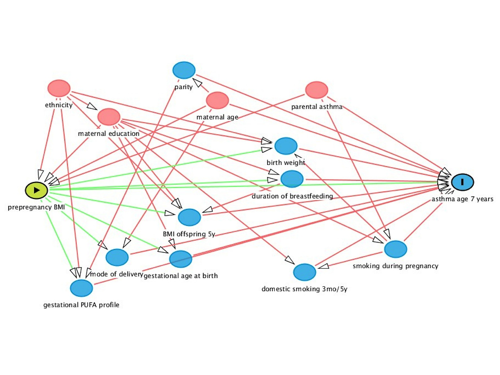

# Basic Epidemiology

**OBJECTIVES**

After reading this chapter, reader should be able to:

-   Construct a logical causal diagram based on your area of research interest as an aid to guiding your study design and analyses

-   Select the appropriate sampling strategy for a particular situation, taking into account the requirements, advantages and disadvantages of each method.

-   Identify the different types of selection bias and assess whether or not a particular study is likely to suffer from excess selection bias.

-   Explain the different ways of measuring disease frequency and differentiate among counts, proportions, odds and rates.

-   Calculate and interpret the following measures of association: risk ratio, odds ratio, incidence rate ratio, risk difference (attributable risk), attributable fraction (exposed), population attributable risk, attributable fraction (population).

-   Understand the strength and weaknesses of various study designs for the identification and evaluation of causal factors.

## About the book

Our rationale for doing research is to identify potentially causal associations between **exposures and outcomes** (the center of the diagram). In many cases, the exposures are risk factors and the outcome is a disease of interest. However, this is not the only scenario; for example, our outcome of interest might be a measure of productivity or food safety and the exposures might include certain diseases.

{width="736"}

Ultimately, we aim to make causal inferences (bottom right of diagram) and Chapter 1 discusses some important concepts of causation as they relate to epidemiologic research. Any study starts with an overall study design and the main observational study types are discussed in *Chapters 1.6.* In any study, it is important to identify the target population and obtain a study group from it in a manner that does not lead to selection bias. Sampling and selection bias is discussed in *Chapter 1.3.* Once we have identified our study subjects, it is necessary to obtain data on exposure variables, extraneous variables and the outcome in a manner that does not lead to information bias (*Chapter 1.7*). Two important tools that are used in that process are questionnaires (*Chapter 1.4*) and diagnostic and screening tests (*Chapter 1.4*). In order to start the process of establishing an association between exposure and outcome, we need to settle on a measure of disease frequency (*Chapter 1.3*) and select a measure of association (*Chapter 1.5*) that fits the context. In many cases, the study design will determi4e the measures that are appropriate. Confounding bias is a major concern in observational studies, and the identification of factors that should be controlled as confounders is featured in *Chapter 1.7*.

Basic data analysis will be presented in *Chapter 2*. You will learn essential skills to conduct data analysis with different programming languages such as R and Python or statistical software like STATA. You will also introduced on how to communicate your works with other scientists and readers using Rmarkdown (*Chapter 2.7*) and ShinyApp (*Chapter 2.8*). *Chapter 2.9* will provides you a road map for investigators starting into the analysis of an epidemiologic dataset.

With our data in hand, we are now able to begin to model relationships with the intent of estimating causal effects of exposure (*Chapter 3*). Individual chapters are dedicated to the analyses appropriate for outcomes that are continuous (*Chapter 3.2*), dichotomous (*Chapter 3.3*), nominal/ordinal (*Chapter 3.4*), count (*Chapter 3.5*) and time-to-event data (*Chapter 3.6*). *Chapter 3.1* presents some general guide lines on model-building techniques that are applicable to all types of model. In one health epidemiologic research, we often encounter clustered or correlated data and these present major challenges in their analyses. *Chapter 3.7.1* introduces these while *Chapters 3.7.2* and *Chapters 3.7.3* focus on mixed (random effects) models for continuous and discrete outcomes. *Chapters 3.7.4* presents some alternative methods of analysis for dealing with clustered data.

Other important tools in epidemiology, including Risk analysis (*Chapter 4*), Spatial epidemiology (*Chapter 5*), Estimating true prevalence of a diseases (*Chapter 6*) and Infections diseases modelling (*Chapter 7*) will also be discussed

Other models and tools will be mentioned in *Chapter 8*. Structured reviews and assessments of the literature in the form of meta-analyses are becoming increasingly important and are introduced in *Chapter 8.3*. In *Chapter 9*, we will introduce about digital data collection tool (*Chapter 9.1*) and visualization tools (*Chapter 9.2*)

## Causual concept

### Experimental versus observational evidence

**Experimental evidence**

A major goal for epidemiologic research is to identify factors that can be manipulated to maximise health or prevent disease. In other words, we need to identify causes of health and disease. For our purposes, *a cause is any factor that produces a change in the severity or frequency of the outcome*. In searching for causes, we stress the holistic approach to health. The term holistic might suggest that we try to identify and measure every suspected causal factor for the outcome of interest. Yet, quite clearly, we cannot consider every possible factor in a single study. Rather, we place limits on the portion of the "real world" we study and, within this, we constrain the list of factors we identify for investigation.

Traditionally, the gold standard approach to identifying causal factors is to perform an experiment. In the ideal experiment, we randomise some animals (or human) to receive the factor and some to receive nothing, a placebo, or a standard intervention (treatment). In this context, exposure X is a proven cause of outcome Y, if in an ideal experiment X is changed and, as a result, the value or state of Y also changes. In this example, X explicitly precedes Y temporally and an variables (known and unknown) that do not intervene between X and Y are made independent of X through the process of randomisation (this means that extraneous variables do not confound or bias the results we attribute to the exposure X). Factors that are positioned temporally or causally between X and Y are not measured and are of no concern with respect to answering the causal objective of the trial.

The measure of causation in this ideal trial is called the causal *effect coefficient* and indicates the difference in the outcome between the 'treated' and 'non-treated' groups. For example, if the risk of the outcome in the group receiving the treatment is denoted R1 and the risk in the group not receiving the treatment is R0, then we might choose to measure the effect of treatment using either an absolute measure (ie risk difference - RD) or a relative measure (ie risk ratio - RR). If this difference is greater than what could be attributed to chance, then we would say that we have proved that the factor is a cause of the outcome event. A key point is that all causal-effect statements are based on *contrasts* of treatment levels; the outcome in the treated group cannot be interpreted without knowing the outcome in the untreated group. A second key feature is *exchangeability*; that is the same outcome would be observed (except for sampling error) if the assignments of treatment to study subjects had been reversed (ie if the treated group had been assigned to be untreated). Randomisation provides the probabilistic basis for the validity of this assumption.

**Observational evidence**

ln observational studies, we estimate the difference in values of Y between units that happen to have different values of X. We do not control whether a subject is, or is not, exposed. Variables related to both X and Y and which do not intervene between X and Y, can be controlled analytically or through matching or restricted sampling. *The appropriate measure of association (eg a risk ratio or regression coefficient) reflecting the difference in the value of Y between the 'exposed' and 'non-exposed' groups can be used to obtain a reasonable estimate of the causal-effect coefficient that would be obtained in the ideal experiment*. The major differences between observational studies and field experiments lie in the ability to prevent selection, misclassification and confounding bias, and dealing with the impact of unknown or unmeasured factors. Thus, by themselves, *observational studies produce measures of association but cannot 'prove' causation*. Nonetheless, in the ideal observational study, with total control of bias, the measure of association will estimate the causal-effect coefficient.

### Model of causation

Given our belief in multiple causes of an effect and multiple effects of a specific cause, epidemiologists have sought to develop conceptual models of causation. Usually, however, the *actual causal model is unknown* and the *statistical measures* of association we use *reflect, but do not explain*, the number of ways in which the exposure might cause disease. Furthermore, although our main interest in a particular study might focus on one exposure factor, we need to take into account the effects of other causes of the outcome that are related to the exposure. The two major conceptual models are the component-cause and the causal-web models of causation.

**Component-cause model**

The component-cause model is based on the concepts of necessary and sufficient causes. A necessary cause is one without which the disease cannot occur (ie the factor will always be present if the disease occurs). In other word, *a component cause is one of a number of factors that, in combination, constitute a sufficient cause*. The factors might be present concomitantly or they might follow one another in a chain of events. In tum, when there are a number of chains with one or more factors in common, we can conceptualise the web of causal chains (ie a causal web). This concept will be explained further under the causal-web model. One of the benefits of thinking about causation in this manner is that it helps us understand how the prevalence of a cofactor can impact on the strength of association between the exposure factor and the outcome of interest.

**Causal-web model**

A second way of conceptualising how multiple factors can combine to cause disease is through a causal web consisting of *indirect and direct causes*. This concept is based on a series of interconnected causal chains or web structures; it takes the factors portrayed in the sufficient-cause approach and links them temporally. For a *direct cause*, there must be no known intervening variable between that factor and the disease (diagrammatically, the exposure is adjacent to the outcome). Direct causes are often the proximal causes emphasised in therapy, such as specific microorganisms or toxins. In contrast, an *indirect cause* is one in which the *effects of the exposure on the outcome are mediated through one or more intervening variables*. It is important to recognise that, in terms of *disease control, direct causes are no more valuable than indirect causes*.

With a number of possible causal variables, the cause-and-effect relationships are best shown in a *causal diagram* (also called *directed acyclic graphs*, or modified path models). To construct a causal diagram, we begin by imposing a plausible biological causal structure on the set of variables we plan to investigate and translate this structure into graphical form that explains our hypothesised and known relationships among the variables. The causal-ordering assumption is usually based on known time-sequence and/or plausibility considerations. For example, it might be known that one variable precedes another temporally, or current knowledge and/or common sense might suggest that it is possible for one factor to cause another but not vice-versa.

[Red arrows:]{style="color:#f33842"} open biasing paths; *Green arrows:* open causal paths;

[Pink oval:]{style="color:#fb8b91"} ancestor of exposure; [Blue ovals:]{style="color:#43aee6"} ancestor of outcome.

### Causal criteria

A list of criteria for making valid causal inferences includes: time sequence, strength of association, dose-response, plausibility, consistency, specificity, analogy and experimental evidence. Today, we might add evidence from meta-analysis to this list.

**Study design and statistical issues**

If the differences observed in a well-designed study have P-values above 0.4, this would not provide any support for a causal relationship. However, beyond extremes in large P-values, statistical significance should not play a pivotal role in assessing causal relationships.

**Time sequence**

While a cause must precede its effect, demonstrating this fact provides only weak support for causation. Further, the same factor could occur after disease in some individuals and this would not disprove causation except in these specific instances. Many times it is not clear which came first; for example, did the viral infection precede or follow respiratory disease? This becomes a greater problem when we must use surrogate measures of exposure (eg antibody titre to indicate recent exposure). Nonetheless, we would like to be able to demonstrate that an exposure preceded the effect or at least develop a rational argument for believing that it did - sometimes these arguments are based largely on plausibility rather than on demonstrable facts

**Strength of association**

This is usually measured by ratio measures such as risk ratio or odds ratio but could also be measured by risk or rate differences. The belief in larger (stronger) associations being causal appears to relate to how likely it is that unknown or residual confounding might have produced this effect. When studying diseases with very high frequency, risk ratio measures of association will tend to be weaker than with less common diseases.

**Dose response relationship**

If we had a continuous, or ordinal, exposure variable and the risk of disease increased directly with the level of exposure, then this evidence supports causation as it tends to reduce the likelihood of confounding and is consistent with biological expectations. However, in some instances, there might be a cutpoint of exposure such that nothing happens until a threshold exposure is reached and there is no further increase in frequency at higher levels of exposure.

**Coherence or plausibility**

Coherence requires that the observed association is explicable in terms of what we know about disease mechanisms. However, our knowledge is a dynamic state and ranges all the way from the observed association being assessed as 'reasonable' (without any biological supporting evidence) to requiring that 'all the facts be known' (a virtually nonexistent state currently). Postulating a biological mechanism to explain an association after the fact is deemed to be insufficient for causal inferences unless there is some additional evidence supporting the existence of that mechanism

**Consistency**

If the same association is found in different studies by different workers, this gives support to causality. Lack of consistency doesn't mean that we should ignore the results of the first study on a subject, but we should temper our interpretation of the results until they are repeated. This would prevent a lot of false positive scares in both human and veterinary medicine.

**Specificity of association**

It used to be thought that, if a factor was associated with only one disease, it was more likely causal than a factor that was associated with numerous disease outcomes.

**Analogy**

This is not a very important criterion for assessing causation, although there are examples of its being used to good purpose. This approach tends to be used to infer relationships in cases of human diseases based on experimental results in other animal species.

**Experimental evidence**

This criterion perhaps relates partly to biological plausibility and partly to the additional control that is exerted in weIl-designed experiments. We tend to place more importance on experimental evidence if the same target species is used and the routes of challenge, or nature of the treatment are in line with what one might expect under field conditions. Experimental evidence from other species in more contrived settings is given less weight in our assessment of causation. Indeed, the experimental approach is just another way to test the hypothesis, so this is not really a distinct criterion for causation in its own right.

## Sampling

Chapter 2 và Chapter 12

## Measures of diseases frequency

Chapter 4

## Measures of association

Chapter 6

## Introduction about different studies design

### Introduction about observational studies

Chapter 7

### Cohort studies

Chapter 8

### Case-control studies

Chapter 9

### Hybrid study designs

Chapter 10

### Longitudinal study and time series data

To be searched

### Controlled trials

Chapter 11

## Confounder bias

Chapter 13
